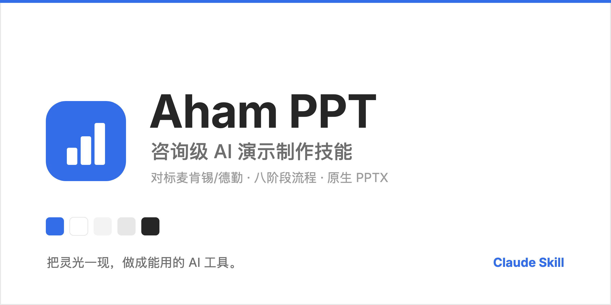
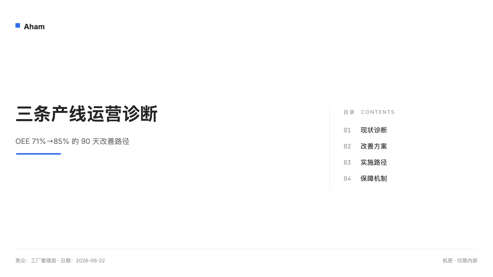
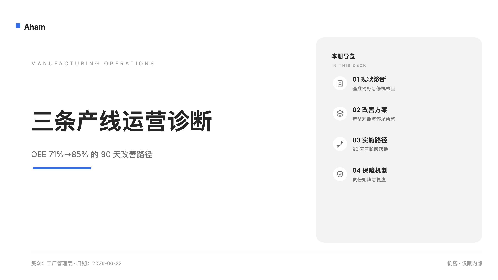
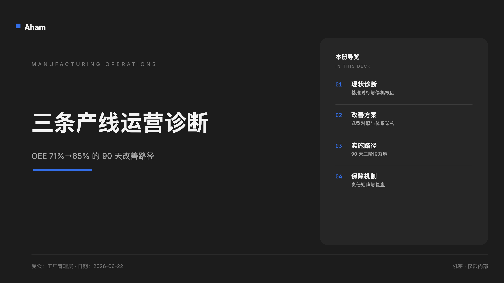
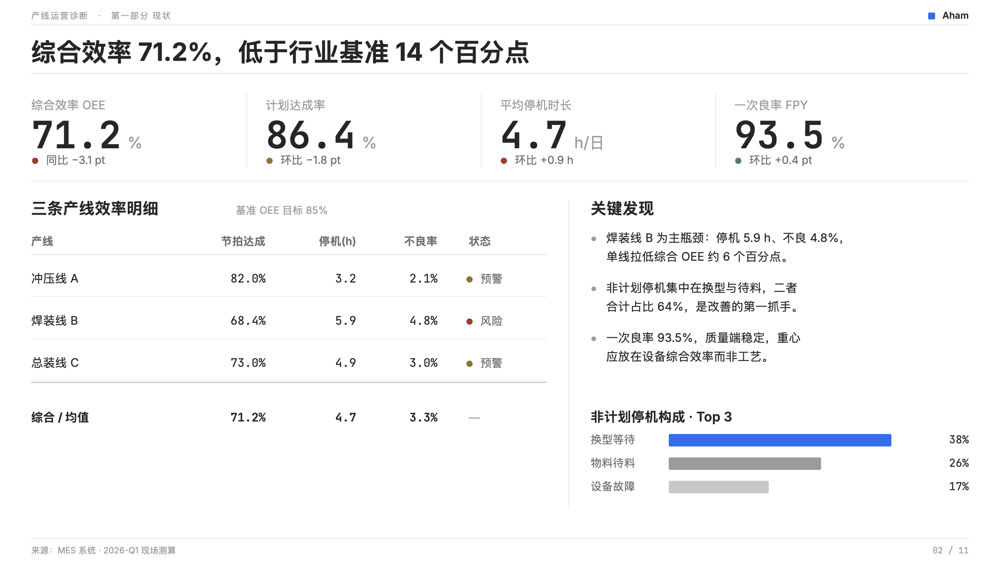
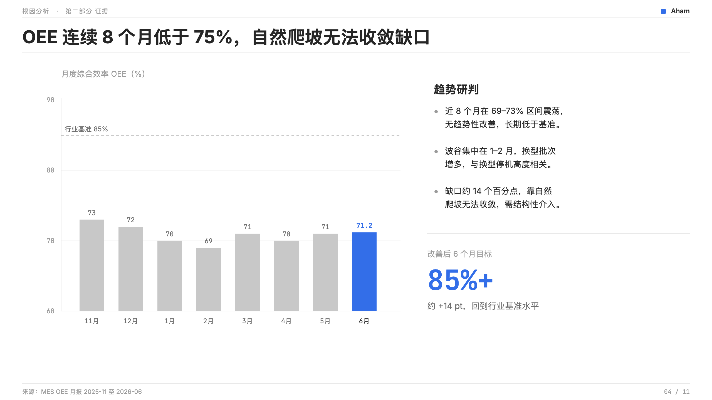
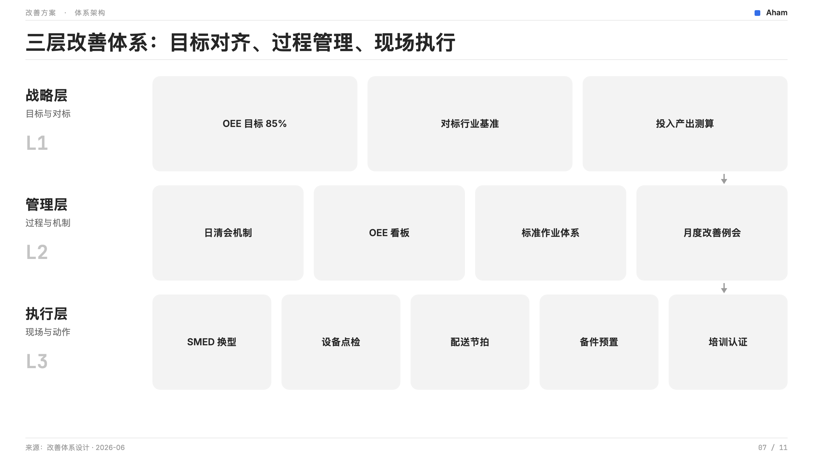

# Aham PPT — 克制的 AI PPT 制作技能

## 为什么做这个技能

市面上的 AI 做 PPT，大多是「一句话出一份能看的 PPT」——快，但只到「能看」。而要拿去给客户、给领导的**方案、汇报、报告**，需要的是逻辑站得住、论证有依据、版面专业克制、能直接交付的水准——这不是一键速成能给的。

这个技能为此而做：它不追求秒出，而是按资深顾问的成稿流程一步步推进，把零散素材做成**方案级 / 报告级**的专业 PPT。

---

## 定位

产出的不是「好看的模板 PPT」，而是一份经得起审视的专业交付物：

- **专业** — 像资深顾问写的白皮书：逻辑、数据、措辞都站得住，经得起客户和领导推敲。
- **简洁克制** — 一页一个核心结论，留白优先；不堆字、不花哨、不靠装饰撑场面。
- **内容优先** — 视觉只为内容服务，该上图表上图表、该留白留白，不喧宾夺主。
- **通篇一致** — 全册一套规范，没有东拼西凑的模板拼贴感。

> 简言之：做的是「方案 / 报告」，不是「标准模板速成片」。

---

## 八步法

技能的核心是一条八步流水线，每一步都为「最后那份 PPT 够不够专业」负责：

**1 · 规范加载**　先把品牌的色值、字体、禁用项装进上下文，后面每页都照同一套规范走。解决的是「每页风格各异、AI 自己发明配色」的失控。

**2 · 材料解析**　把你丢进来的文档 / 数据 / 纪要拆成结构化的事实、数据、问题、结论，分清哪些有来源、哪些待确认。这样后面的论证才有据可依，也不会编数字。

**3 · 论点提炼**　用金字塔原理从材料里逼出一句话核心结论（灵魂句），让整份 PPT 有立场、能说服，而不是一堆信息的流水账。

**4 · 叙事骨架**　先把每页标题排成一条论证链（Ghost Deck）——只读标题就知道全篇在讲什么。先把逻辑定下来，避免做到一半发现方向错了再推翻重来。

**5 · 大纲版式**　为每页定内容要点和版式：数据上图表、流程上结构图，而不是页页堆 bullet。这一步直接决定了「专业感」和「会不会平淡」。

**6 · 样稿确认**　先做 3–5 页样稿和你对齐视觉方向，确认后再铺全册——3 页改比 50 页改省太多。

**7 · 逐页设计**　按规范逐页出图，再用工具链转成**原生可编辑**的 PPTX（不是图片，能直接在 PowerPoint 里改）。

**8 · 质检交付**　出片前按清单逐项扫：颜色合规、字体一致、数据有来源、版式有节奏，问题修掉再交付。

---

## 样式与示例

三档视觉风格 **共用同一套内容与组件，只切视觉层**，都坚持单一主色 + 中性灰：A 克制档（白皮书）· B 现代专业档（默认）· C 高表现力档（深色重音 / 竞标）。

<table>
<tr>
<td width="33%"> <b>A · 克制档</b> · 极简白皮书</td>
<td width="33%"> <b>B · 现代专业档（默认）</b> · Hero + 章节块</td>
<td width="33%"> <b>C · 高表现力档</b> · 深色重音</td>
</tr>
</table>

内容页样式举例（统一：纯白底 · 数字 mono · 文档式表格 · 状态点 + 文字）：

<table>
<tr>
<td width="33%"> <b>KPI 看板</b> · 指标条 + 文档表</td>
<td width="33%"> <b>趋势图</b> · 灰阶柱 + 一抹蓝</td>
<td width="33%"> <b>三层架构</b> · 战略 / 管理 / 执行</td>
</tr>
</table>

> 完整 11 页样张 + 可编辑版 → [aham-ppt-v6.1-demo.pptx](examples/aham-ppt-v6.1-demo.pptx)

---

## 使用方法

最简单：**把本仓库地址 `https://github.com/li599198347-svg/aham-ppt` 发给 Claude，让它把技能装好**；或下载本仓库后，把技能文件上传给 Claude。

装好后对 Claude 说「帮我做 PPT / 做客户方案 PPT」即可——技能会自动按八步法推进，开场先问你选视觉档（默认 B）。

---

## 更新记录

[Releases](https://github.com/li599198347-svg/aham-ppt/releases) · [CHANGELOG](CHANGELOG.md)（Keep a Changelog · SemVer） · [CONTRIBUTING](CONTRIBUTING.md) · [MIT](LICENSE)

---

## 关于 Aham

> 把灵光一现，做成能用的 AI 工具。Aham 来自 *aha moment*，每个工具只把一件事做利落。

| 应用 | 一句话 |
|---|---|
| [Aham UI](https://github.com/li599198347-svg/aham-ui) | 供 AI 消费的设计系统——写一次规范，AI 产出处处一致 |
| [Aham Survey](https://github.com/li599198347-svg/aham-survey) | 现场调研工具（macOS）——本地优先，把现场对话做成结构化调研成果 |
| [Aham Voice](https://github.com/li599198347-svg/aham-voice) | 录音转写与会议纪要（macOS）——本地离线转写，纪要走你自己的模型 |
| **Aham PPT** | 克制的 AI PPT 制作技能——把素材做成方案级 PPT |

来源与脱敏说明见 [`ORIGIN.md`](ORIGIN.md)。
