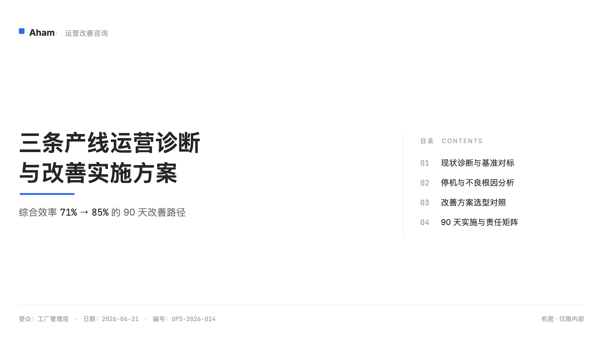
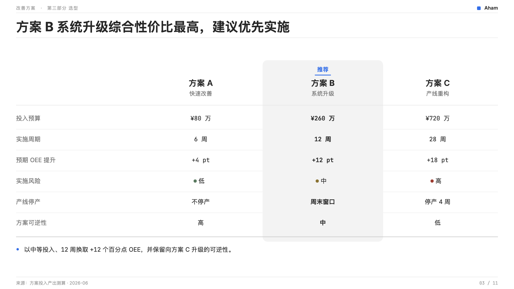
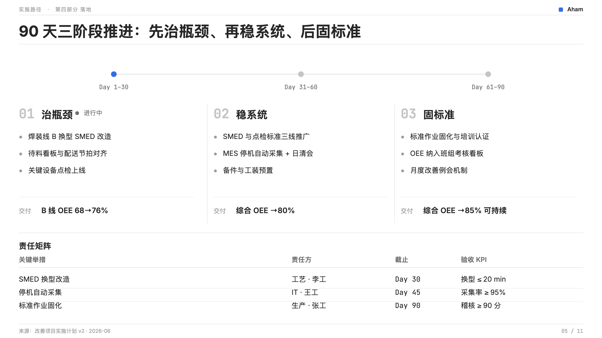
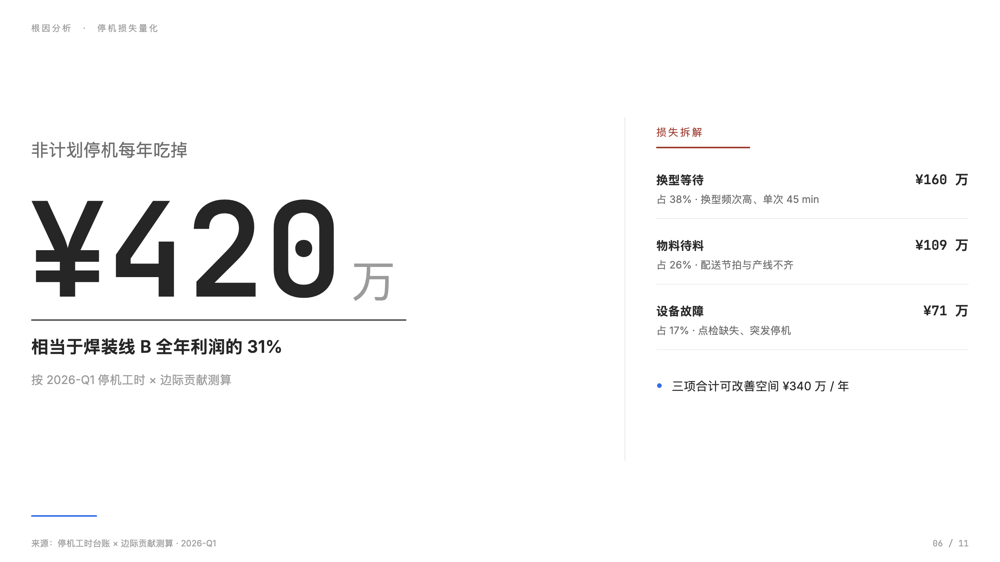
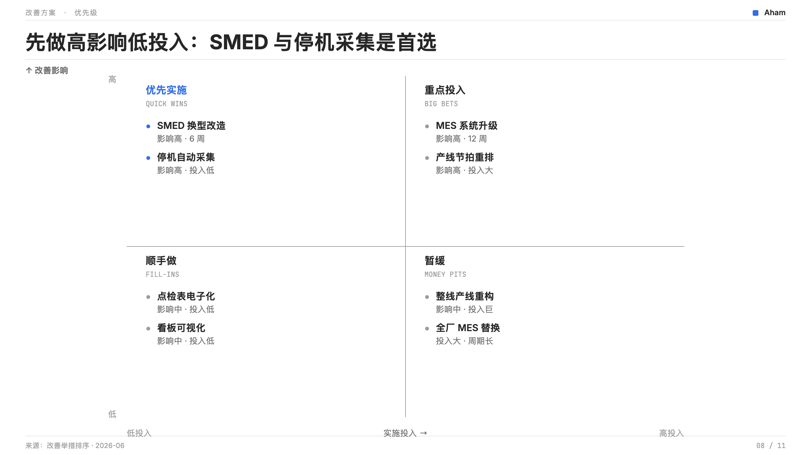
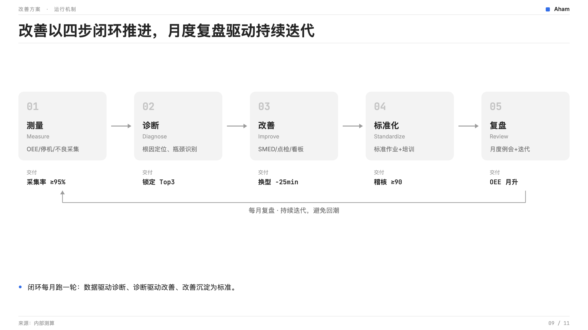
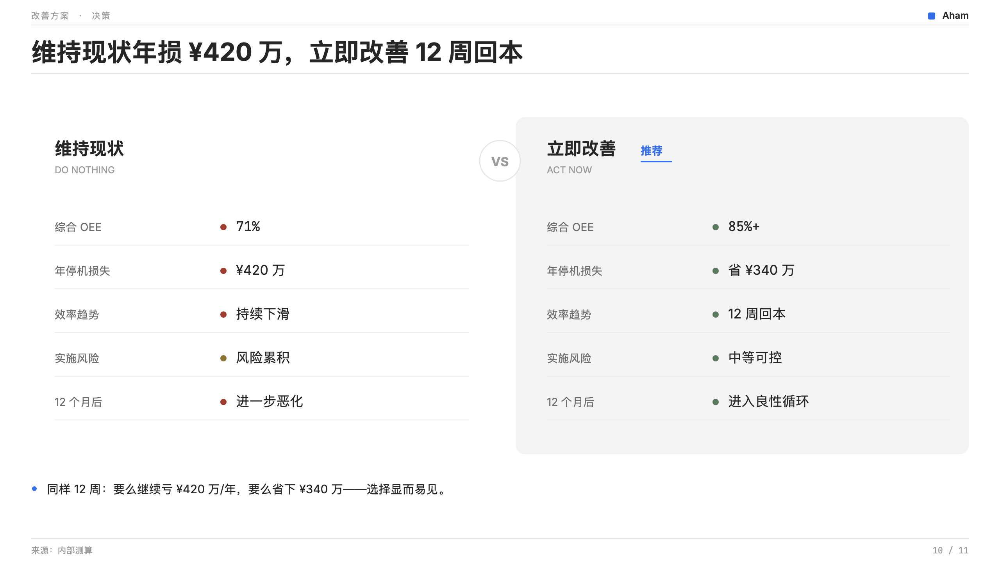
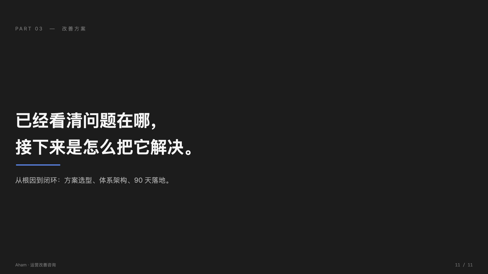

# Aham PPT — 咨询级 AI PPT 制作技能

[](https://github.com/li599198347-svg/aham-ppt/releases)
[](LICENSE)
[](https://github.com/li599198347-svg/aham-ui)
[](#)


> **Aham 应用矩阵**：[Aham UI](https://github.com/li599198347-svg/aham-ui) · [Aham Survey](https://github.com/li599198347-svg/aham-survey) · [Aham Voice](https://github.com/li599198347-svg/aham-voice) · **Aham PPT**

一套对标麦肯锡/德勤标准的 AI PPT 制作技能，含完整八阶段流程 + 原生 PPTX 输出工具链。

> 📘 **Aham 是虚构的示例品牌。** 你可以直接使用本技能生成"Aham 风格"的 PPT，
> 也可以（推荐）将它替换为你自己的品牌。替换指引见本文档下方。
>
> 关于本技能的来源与脱敏说明，见 `ORIGIN.md`。

## 预览

> 用本技能（Aham UI v6.1）生成的 11 页样张：**底永远纯白 · 蓝是点缀 · 文档式表格 · 留白分隔 · 数字 mono · 状态点+文字**。
> 可编辑版 → [aham-ppt-v6.1-demo.pptx](examples/aham-ppt-v6.1-demo.pptx)　·　一键生成 → [build_examples.py](examples/build_examples.py)



<table>
<tr>
<td width="50%"><br><sub><b>02</b> · KPI 看板（指标条 + 文档表 + 关键发现 + Top3）</sub></td>
<td width="50%"><br><sub><b>03</b> · 方案选型对照（推荐列=灰底非蓝 + 蓝「推荐」点缀）</sub></td>
</tr>
<tr>
<td><br><sub><b>04</b> · 证据 · 趋势图（灰阶柱 + 一抹蓝高亮）</sub></td>
<td><br><sub><b>05</b> · 实施路线 + 责任矩阵（里程碑轴 + 三阶段 + 表）</sub></td>
</tr>
<tr>
<td><br><sub><b>06</b> · 大数字冲击（mono 巨号 + 损失拆解）</sub></td>
<td><br><sub><b>07</b> · 三层架构图（战略/管理/执行 × 模块面板）</sub></td>
</tr>
<tr>
<td><br><sub><b>08</b> · 2×2 优先级矩阵（蓝只染「优先实施」象限）</sub></td>
<td><br><sub><b>09</b> · 流程闭环（五步 + 反馈回路）</sub></td>
</tr>
<tr>
<td><br><sub><b>10</b> · VS 对照（现状 vs 改善 · 点+文字双通道）</sub></td>
<td><br><sub><b>11</b> · 深色过渡（暗色提案调色板，章节切换）</sub></td>
</tr>
</table>

---

## 快速开始

### 1. 安装技能

将整个 `aham-ppt/` 目录放到你的 Claude 技能路径下。

**Claude Code 或 Claude 桌面版的标准路径**：
```
~/.claude/skills/user/aham-ppt/
```

**Claude.ai Web 的标准路径**：
```
/mnt/skills/user/aham-ppt/
```

### 2. 触发技能

在 Claude 对话中，说出以下任一触发词即可：

- 帮我做 PPT
- 做演示文稿
- 做一个汇报
- 根据这份资料做 PPT
- 做客户方案 PPT
- 制作幻灯片

技能会自动按八阶段流程推进，从规范加载到质检交付全程覆盖。

### 3. 准备素材

执行前请准备好：
- 需要转化为 PPT 的原始素材（文字、数据、图表、PDF 均可）
- 明确的受众（给客户老板 / 给内部管理层 / 给投资人？）
- 预期篇幅（10 页 / 30 页 / 50 页？）
- 交付时间（影响流程中每一步的深度）

---

## 换成你自己的品牌（4 步）

### Step 1：替换品牌元信息

编辑 `references/brand-spec/brand.md` 开头的 Brand 块：

```markdown
**Brand**: 你的品牌名
**Locale**: 你的主要语言环境
**Applicability**: 你的品牌调性描述
**Brand attributes**: 你的品牌属性关键词
```

### Step 2：替换强调色

编辑 `references/brand-spec/tokens.css`，把唯一的强调色相换成你自己的：

```css
--accent:       #你的主色;   /* 强调蓝 · 唯一色相 · 仅点缀 */
--accent-hover: #略浅色;
--accent-press: #略深色;     /* 蓝底需更深时 */
```

> 强调色只用于 logo / 主操作 / 选中下划线 / 推荐标 / 单个高亮数据点，**绝不铺底**——
> 「蓝若第一眼注意到就超标」。三层表面（`--surface-1/2/3`）与四级墨色（`--ink-1~4`）
> 是冷色中性体系，建议沿用默认，不必随品牌色改动。

### Step 3：替换字体栈（可选）

本规范用**单一无衬线 + 等宽数字**，不用衬线。默认字体栈：

```css
--ff-sans: "Inter", "Microsoft YaHei", "PingFang SC", ...;   /* 正文/标题 · 无衬线 */
--ff-mono: "JetBrains Mono", "Consolas", ...;                /* 数字/代码 · 等宽 */
```

如果你的品牌用了不同字体，把西文换成你的无衬线字体、CJK 换成你的黑体即可；
层级靠字号 + 字重建立，不靠衬线、不靠颜色。**不要引入衬线字体做正文。**

### Step 4：搜索替换剩余的 "Aham" 字样

```bash
cd aham-ppt/
grep -rn "Aham\|aham" .
```

把出现的品牌名替换为你自己的品牌名即可。

---

## 目录结构

```
aham-ppt/
├── SKILL.md                      # 技能入口（YAML 头触发配置）
├── ORIGIN.md                     # 本技能的脱敏说明
├── README.md                     # 本文件
├── LESSONS.md                    # 24 个场景化经验索引（供人阅读）
│
├── assets/                       # 工具链代码
│   ├── README.md
│   ├── svg_to_pptx_wrapper.py    # 对外入口
│   └── svg_to_pptx/              # SVG → 原生 PPTX 工具链主体
│
└── references/                   # 方法论与规范
    ├── brand-spec/               # ★ 品牌视觉规范（替换这里的内容适配你的品牌）
    │   ├── brand.md              # 主规范（色彩/字体/禁用）
    │   ├── track-rules.md        # 四轨道分流规则
    │   ├── tokens.css            # CSS 变量（色值/字体栈）
    │   └── iconography.md        # 图标规范
    │
    ├── designer-rules.md         # 设计师执行规则
    ├── chart-impl.md             # 图表实现
    ├── coach-engine.md           # 教练引擎（能力自适应）
    ├── grid-system.md            # 网格系统
    ├── quality-audit-protocol.md # 质检协议
    ├── pptx-native-rules.md      # 原生 PPTX 输出规则
    │
    ├── phase-01.md ~ phase-08.md # 八阶段流程详细指引
    ├── layout-library.md         # 版式库总览
    ├── layout-impl-*.md          # 各版式类型的实现（7 个文件）
    └── svg-skeleton-*.md         # 各版式的 SVG 骨架模板（7 个文件）
```

---

## 八阶段流程

本技能的核心是这条八阶段流水线：

| # | 阶段 | 产物 |
|---|---|---|
| 1 | 规范加载 | 确认轨道 A，加载色值、字体、禁用清单 |
| 2 | 材料解析 | 从原始素材中提取关键信息、证据、数字 |
| 3 | 论点提炼 | 按麦肯锡金字塔结构提炼核心论点 |
| 4 | 叙事骨架 | 搭建 Ghost Deck（每页一句话的结论骨架） |
| 5 | 大纲版式 | 规划 Part 结构、每页版式类型 |
| 6 | 样稿确认 | 选 3-5 页做样稿，与用户对齐视觉方向 |
| 7 | 逐页设计 | 生成所有页的 SVG + 调用工具链转为 PPTX |
| 8 | 质检交付 | 按 QC 清单逐项扫描、修正、最终交付 |

详细指引见 `references/phase-01.md` ~ `phase-08.md`。

---

## 设计哲学（四个支柱）

北极星是极简、克制、留白、内容优先的桌面 AI 气质；性格「冷色的纸」。
本规范的四条核心原则：

1. **清晰优先** — 内容是主角；用留白与字号建立秩序，先加间距再考虑加线
2. **层次靠层差** — 深度来自三层背景（#FFFFFF / #F3F3F3 / #E7E7E7）的灰度层差，不靠材质、边框或阴影；卡片无边框无阴影，选中是扁平灰非蓝
3. **蓝是点缀** — 蓝 #336EE8 是唯一色相，只用于 logo / 主操作 / 选中下划线 / 推荐标 / 单个高亮数据点，绝不铺底；「蓝若第一眼注意到就超标」
4. **单一无衬线** — 一套无衬线（西文 Inter / CJK 雅黑·黑体）+ 等宽数字（JetBrains Mono），层级靠字号 + 字重，不靠衬线、不靠颜色；状态用 6px 点 + 文字表达，不用红黄绿灯

**绝对禁用**：渐变 · 3D · 投影（浮层除外）· 纯黑 #000 · 衬线 · 第二装饰彩色 · 蓝色铺底 / 整行整列铺色 · 红黄绿灯 · 饼图 · 表格竖线 · emoji · 圆角滥用。

---

## 相关资源

- `ORIGIN.md` — 本技能的来源与脱敏说明
- `LESSONS.md` — 24 个场景化经验，供人工翻阅
- `references/brand-spec/brand.md` — 品牌规范完整文档
- `references/designer-rules.md` — 设计师执行细则
- 参与贡献与发版流程见 [CONTRIBUTING.md](CONTRIBUTING.md)

---

## 版本与许可

- [Releases](https://github.com/li599198347-svg/aham-ppt/releases) — 版本下载与发布说明
- [CHANGELOG.md](CHANGELOG.md) — 版本变更记录（Keep a Changelog）
- [LICENSE](LICENSE) — MIT 许可证

---

## 关于 Aham

> **把灵光一现，做成能用的 AI 工具。**

Aham 来自 *aha moment*。每个工具只把一件事做利落。

| 应用 | 一句话 |
|---|---|
| [Aham UI](https://github.com/li599198347-svg/aham-ui) | 供 AI 消费的设计系统——写一次规范，AI 产出处处一致 |
| [Aham Survey](https://github.com/li599198347-svg/aham-survey) | 现场调研工具（macOS）——聊一圈，调研结果自己长出来 |
| [Aham Voice](https://github.com/li599198347-svg/aham-voice) | 录音转写与会议纪要（macOS）——录一段会，纪要已经写好 |
| [Aham PPT](https://github.com/li599198347-svg/aham-ppt) | 咨询级 AI PPT 制作技能——丢一堆素材，幻灯片出来了 |
